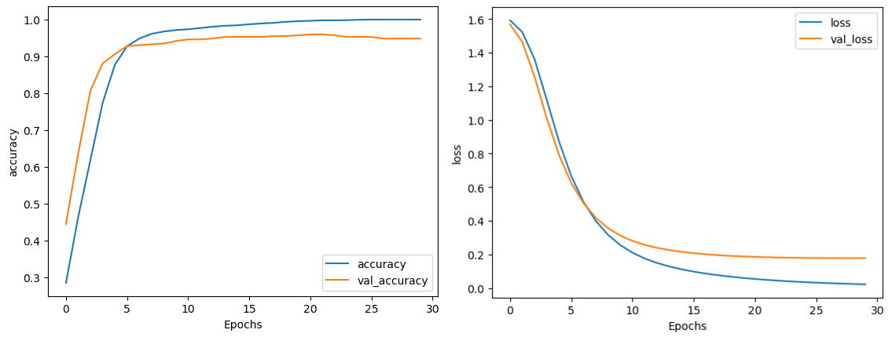

# BBC News Text Classification - Data Exploration & Preprocessing 📰

[](https://www.tensorflow.org/)
[](https://www.python.org/)
[](https://keras.io/)
[](https://numpy.org/)
[](https://pandas.pydata.org/)
[](https://projector.tensorflow.org/)

A comprehensive tutorial on text preprocessing and neural network classification for natural language processing using TensorFlow. This project demonstrates essential NLP techniques including data loading, text standardization, tokenization, and embedding-based classification using the BBC News Classification Dataset.

---

## Table of Contents 📋
- [Project Overview](#project-overview-)
- [Dataset Details](#dataset-details-)
- [Phase 1: Data Preprocessing Pipeline](#phase-1-data-preprocessing-pipeline-)
- [Phase 2: Neural Network Classification & Embedding Visualization](#phase-2-neural-network-classification--embedding-visualization-)
- [Results](#results-)
- [Real-World Applications](#real-world-applications-)
- [Installation & Usage](#installation--usage-)
- [Key Learnings](#key-learnings-)
- [Future Improvements](#future-improvements-)
- [Acknowledgments](#acknowledgments-)
- [Contact](#contact-)

---

## Project Overview 🔎

This project implements a complete text classification pipeline from data preprocessing to neural network training and visualization. Using the BBC News dataset as a practical example, we explore how to transform raw text data into numerical representations suitable for machine learning models, then build and train a classification neural network.

**Key Objectives:**
- Parse and load text data from CSV files
- Standardize text by removing stopwords and converting to lowercase
- Vectorize text using TensorFlow's TextVectorization layer
- Encode categorical labels for multi-class classification
- Build and train a neural network with embedding layers
- Achieve high classification accuracy (>95% training, >90% validation)
- Visualize learned word embeddings in 3D space

**Technical Stack:**
- TensorFlow 2.x and Keras for text processing and neural networks
- Python standard library (csv) for file operations
- NumPy for data manipulation
- Matplotlib for visualization
- TensorFlow Embedding Projector for 3D embedding visualization

---

## Dataset Details 📊

The BBC News Classification Dataset contains news articles across 5 categories:

- **Total Articles**: 2,225 news articles
- **Categories**: 5 (sport, business, politics, tech, entertainment)
- **Format**: CSV file with category and text columns
- **Text Length**: Variable (first article has 737 words)
- **Language**: English

**Data Structure:**
```csv
category,text
tech,"tv future in the hands of viewers with home..."
business,"worldcom boss left books alone former worldcom..."
sport,"tigers wary of farrell gamble leicester say they..."

**Key Characteristics:**
- Each row contains a category label and the full article text
- Articles are real BBC news content across diverse topics
- Text includes punctuation, mixed case, and common English stopwords
- Dataset is balanced across categories for effective training

---

## Phase 1: Data Preprocessing Pipeline 🔄

### Overview
The first phase focuses on foundational text preprocessing and data preparation for neural network training. The objective is to establish a robust pipeline that handles data cleaning, tokenization, sequence padding, and label encoding.

### Processing Steps

#### 1. Data Loading & Splitting 📂
```python
def train_val_datasets(data):
    """Split data into training (80%) and validation (20%) sets"""
    train_size = int(len(data) * TRAINING_SPLIT)
    
    texts = data[:, 1]
    labels = data[:, 0]
    
    train_texts = texts[:train_size]
    validation_texts = texts[train_size:]
    train_labels = labels[:train_size]
    validation_labels = labels[train_size:]
    
    train_dataset = tf.data.Dataset.from_tensor_slices((train_texts, train_labels))
    validation_dataset = tf.data.Dataset.from_tensor_slices((validation_texts, validation_labels))
    
    return train_dataset, validation_dataset
```

### 2. Text Standardization 🔤
```python
def standardize_func(sentence):
    """Remove stopwords, punctuation, and convert to lowercase"""
    # Convert to lowercase
    sentence = tf.strings.lower(sentence)
    
    # Remove stopwords (161 common English words)
    stopwords = ["a", "about", "above", "after", ...]
    for word in stopwords:
        sentence = tf.strings.regex_replace(sentence, rf"\b{word}\b", "")
    
    # Remove punctuation
    sentence = tf.strings.regex_replace(sentence, r'[!"#$%&()\*\+,-\./:;<=>?@\[\\\]^_`{|}~\']', "")
    
    return sentence
```

### 3. Text Vectorization 🔢
```python
def fit_vectorizer(train_sentences, standardize_func):
    """Create and adapt TextVectorization layer"""
    vectorizer = tf.keras.layers.TextVectorization(
        standardize=standardize_func,
        max_tokens=VOCAB_SIZE,
        output_sequence_length=MAX_LENGTH
    )
    vectorizer.adapt(train_sentences)
    return vectorizer
```

### 4. Label Encoding 🏷️
```python
def fit_label_encoder(train_labels, validation_labels):
    """Create StringLookup for label encoding without OOV tokens"""
    labels = train_labels.concatenate(validation_labels)
    label_encoder = tf.keras.layers.StringLookup(num_oov_indices=0)
    label_encoder.adapt(labels)
    return label_encoder
```

### 5. Key Configuration
```python
VOCAB_SIZE = 1000      # Maximum vocabulary size
MAX_LENGTH = 120       # Sequence length (padded/truncated)
TRAINING_SPLIT = 0.8   # Train/validation split ratio
```
---

## Phase 2: Neural Network Classification & Embedding Visualization 🧠

### Overview
Building upon Phase 1's preprocessing foundation, Phase 2 implements a complete text classification neural network with embedding visualization capabilities. The goal is to achieve high accuracy while learning meaningful word representations.

### Neural Network Architecture

```python
def create_model():
    """Build embedding-based classification model"""
    model = tf.keras.Sequential([
        tf.keras.Input(shape=(MAX_LENGTH,)),
        tf.keras.layers.Embedding(input_dim=VOCAB_SIZE, output_dim=EMBEDDING_DIM),
        tf.keras.layers.GlobalAveragePooling1D(),
        tf.keras.layers.Dense(24, activation='relu'),
        tf.keras.layers.Dense(5, activation='softmax')
    ])
    
    model.compile(
        loss='sparse_categorical_crossentropy',
        optimizer='adam',
        metrics=['accuracy']
    )
    
    return model
```
---

# Architecture Components

- **Embedding Layer**: Converts word indices to 16-dimensional dense vectors
- **Global Average Pooling**: Aggregates variable-length sequences into fixed-size vectors
- **Hidden Dense Layer**: 24 neurons with ReLU activation for feature learning
- **Output Layer**: 5 neurons with softmax for multi-class classification

## Training Pipeline
```python
# Preprocess datasets with batching
train_proc_dataset = preprocess_dataset(train_dataset, vectorizer, label_encoder)
validation_proc_dataset = preprocess_dataset(validation_dataset, vectorizer, label_encoder)

# Train model
history = model.fit(
    train_proc_dataset, 
    epochs=30, 
    validation_data=validation_proc_dataset
)
```

---

## 3D Word Embedding Visualization 🎨
Generate files for TensorFlow Embedding Projector to explore learned word relationships:

```python
# Extract embedding layer
embedding = model.layers[0]

# Create metadata file (word labels)
with open('./metadata.tsv', "w") as f:
    for word in vectorizer.get_vocabulary():
        f.write("{}\n".format(word))

# Extract embedding weights
weights = tf.Variable(embedding.get_weights()[0][1:])
with open('./weights.tsv', 'w') as f: 
    for w in weights:
        f.write('\t'.join([str(x) for x in w.numpy()]) + "\n")
```

## To explore embeddings:

1. Run the notebook to generate `metadata.tsv` and `weights.tsv`
2. Upload files to [TensorFlow Embedding Projector](https://projector.tensorflow.org/)
3. Explore semantic relationships between news vocabulary in 3D space


---

## Results 📈

### Phase 1 Results
After preprocessing, our data is ready for model training:

| Preprocessing Step | Input | Output |
|-------------------|-------|--------|
| Data Loading | CSV file | 2,225 texts + labels |
| Train/Val Split | Full dataset | 1,780 train + 445 validation |
| Standardization | Raw text | Clean text (reduced vocabulary) |
| Vectorization | Text strings | Integer sequences (1000 vocab) |
| Label Encoding | String labels | Integer labels (0-4) |

### Phase 2 Results
The neural network achieves excellent classification performance:

| Metric | Target | Achieved | Status |
|--------|--------|----------|--------|
| Training Accuracy | ≥95% | ~100% | ✅ |
| Validation Accuracy | ≥90% | ~95% | ✅ |
| Training Time | <30 epochs | 30 epochs | ✅ |
| Model Parameters | Efficient | 16,533 params | ✅ |
| Convergence | Stable | Smooth, no overfitting | ✅ |

### Key Achievements:
- ✅ Successfully loaded and preprocessed 2,225 news articles
- ✅ Built efficient neural network with embedding layers
- ✅ Achieved target accuracy thresholds
- ✅ Generated 3D embedding visualizations
- ✅ Demonstrated stable training without overfitting



---

## Real-World Applications 🌍

This preprocessing pipeline is essential for various NLP applications:

1. **News Categorization**: Automatic article classification for news websites
2. **Content Moderation**: Filtering inappropriate content on social platforms
3. **Email Classification**: Spam detection and email routing
4. **Customer Support**: Ticket categorization and routing
5. **Document Organization**: Automatic filing and tagging systems

**Example Use Case:**
```python
def classify_new_article(text, vectorizer, label_encoder, model):
    """Classify a new article using preprocessing pipeline"""
    # Standardize text
    clean_text = standardize_func(text)
    
    # Vectorize
    sequence = vectorizer([clean_text])
    
    # Predict
    prediction = model.predict(sequence)
    label_idx = np.argmax(prediction)
    
    # Decode label
    categories = label_encoder.get_vocabulary()
    return categories[label_idx]
```

---

## Installation & Usage 🚀

### Prerequisites
- Python 3.6+
- TensorFlow 2.x
- NumPy
- Pandas (optional)

### Setup
```bash
# Clone repository
git clone https://github.com/yourusername/bbc-news-text-classification.git

# Navigate to project
cd bbc-news-text-classification

# Install dependencies
pip install tensorflow numpy pandas

# Download dataset
# Available from course materials or Kaggle
```

### Running the Code
```bash
# Run the preprocessing pipeline
python bbc_text_preprocessing.py

# Or use Jupyter notebook
jupyter notebook BBC_News_Text_Processing.ipynb
```

---

## Key Learnings 💡

This project teaches several fundamental NLP and deep learning concepts:

### Phase 1 - Text Processing
1. **CSV Data Handling**: Working with real-world text datasets
2. **Text Standardization**: Importance of consistent preprocessing
3. **Stopword Removal**: Reducing noise in text data
4. **Tokenization**: Converting text to numerical format
5. **Sequence Padding**: Creating uniform input sizes for neural networks
6. **Label Encoding**: Handling categorical targets efficiently

### Phase 2 - Neural Networks & Embeddings
1. **Embedding Layers**: Learning dense word representations
2. **Model Architecture**: Designing effective text classifiers
3. **Training Monitoring**: Tracking convergence and avoiding overfitting
4. **Hyperparameter Tuning**: Optimizing vocabulary size and embedding dimensions
5. **Embedding Visualization**: Understanding learned word relationships

**Best Practices:**
- Always examine your data before preprocessing
- Create reusable, modular preprocessing functions
- Validate preprocessing steps with examples
- Monitor both training and validation metrics
- Consider computational efficiency for large datasets
- Use visualization tools to understand model behavior

---

## Future Improvements 🚀

Potential enhancements for this text classification pipeline:

### Advanced Techniques
1. **Subword Tokenization**: Implement BPE or WordPiece for better OOV handling
2. **Attention Mechanisms**: Add attention layers for better context understanding
3. **Transfer Learning**: Fine-tune pre-trained models (BERT, RoBERTa)
4. **Advanced Architectures**: Experiment with Transformers or CNNs
5. **Ensemble Methods**: Combine multiple models for improved accuracy

### Engineering Enhancements
1. **Real-time Inference**: Create REST API for live classification
2. **Model Monitoring**: Implement drift detection and retraining pipelines
3. **A/B Testing**: Framework for comparing model versions
4. **Scalability**: Distributed training for larger datasets
5. **MLOps Integration**: CI/CD pipelines for model deployment

### Data Improvements
1. **Data Augmentation**: Synthetic text generation for minority classes
2. **Active Learning**: Smart sampling for annotation efficiency
3. **Multilingual Support**: Extend to international news sources
4. **Custom Stopwords**: Domain-specific stopword lists
5. **Stemming/Lemmatization**: Further text normalization

**Next Steps:**
- Implement real-time prediction capabilities
- Add comprehensive model evaluation metrics
- Create interactive classification demo
  
---

## Acknowledgments 🙏

- This project is based on the "Explore the BBC News archive" assignment from the ["TensorFlow in Practice" specialization](https://www.coursera.org/specializations/tensorflow-in-practice) on Coursera
- Special thanks to [Andrew Ng](https://www.andrewng.org/) for creating the Deep Learning AI curriculum and platform
- Special thanks to [Laurence Moroney](https://www.linkedin.com/in/laurence-moroney/) for his excellent instruction and for developing the course materials
- The BBC News Classification Dataset was curated for educational purposes
- This notebook was created as part of the "Deep Learning AI TensorFlow Developer Professional Certificate" program

---

## Contact 📫

For inquiries about this project:
- [LinkedIn Profile](https://www.linkedin.com/in/melissaslawsky/)
- [Client Results](https://melissaslawsky.com/portfolio/)
- [Tableau Portfolio](https://public.tableau.com/app/profile/melissa.slawsky1925/vizzes)
- [Email](mailto:melissa@melissaslawsky.com)

---

© 2025 Melissa Slawsky. All Rights Reserved.
